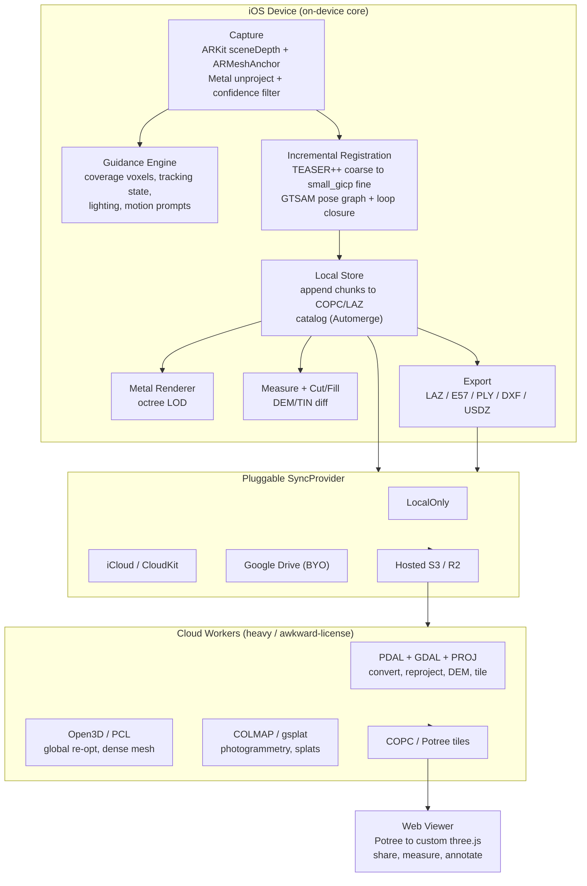

# Architecture Overview

How Fungible is put together and why. This is the living technical reference;
it follows from the [decision records](../decisions) and the
[research dossier](../research). When a structural choice changes, update this
doc **and** add an ADR.

## Shape of the system

Four tiers, with a deliberately **fat on-device core** (so the app is fully
useful offline, per [ADR-0003](../decisions/0003-local-first-pluggable-sync.md))
and a thin, optional cloud:



**Why this split.** Everything on the metric critical path — capture,
registration, storage, measurement, export — runs on-device so a user in a field
with no signal still gets a finished, measurable scan. The cloud is reserved for
work that is genuinely heavy (dense meshing, global re-optimization of very large
sets), needs a non-shippable license quarantined off the app
([buy/build/reuse matrix](../research/buy-build-reuse-matrix.md): PDAL, Open3D,
COLMAP), or is inherently multi-device (sharing, the web viewer).

## On-device module map

The core ships as a Swift Package (`apps/ios/FungibleCore`) of focused modules,
imported by a thin SwiftUI app target. Modules depend **inward** on
`FungibleDomain` and on protocol modules, never outward on UI or ARKit — so the
domain logic is testable on Linux CI without a device.

| Module | Responsibility | Key types / protocols | Heavy deps |
| --- | --- | --- | --- |
| `FungibleDomain` | Pure value types + IDs; no framework deps | `Scan`, `ScanSet`, `PointCloudRef`, `Pose`, `PoseGraph`, `RegionOfInterest`, `Measurement`, `Annotation` | none |
| `FungibleCapture` | Depth→world unprojection + bounded voxel accumulation (pure math; the ARKit `ARFrame` adapter and Metal mirror live in the app) | `CameraIntrinsics`, `Unprojection`, `ConfidenceFilter`, `VoxelAccumulator`, `CapturedPoint` | none |
| `FungibleRegistration` | Grow a set incrementally; maintain the pose graph | `Registrar` (protocol), `CoarseAligner`, `FineAligner`, `PoseGraphOptimizer`, `LoopCloser` | C++ via bridge (future; pure Swift today, ADR-0008) |
| `FungibleStorage` | Local-first persistence + codec | `ScanStore` (protocol), `PointCloudCodec` (FPC1), `ContentHashing`; COPC/CRDT catalog are future bridged work | C/C++/Rust via bridge (future) |
| `FungibleSync` | The pluggable sync layer | `SyncProvider` (protocol), `LocalOnlyProvider`, transfer/resume engine | per-driver |
| `FungibleGuidance` | Real-time scan-quality coaching | `GuidanceEngine`, `CoverageGrid`, `GuidanceSignal`, `Prompt` | none (overlay rendering lives in the app) |
| `FungibleMeasure` | Distance/area/volume + cut/fill | `HeightGrid` (DEM), `CutFillEngine`, `Contours`, `BestFitPlane` | — |
| `FungibleExport` | Pro-format export | `PointCloudExporter`/`MeshExporter` per format (PLY/XYZ/LAS/DXF/OBJ/glTF today; LAZ/E57/COPC/USDZ/LandXML via bridged codecs) | format libs (future) |
| `FungibleEntitlements` | Capability gating (monetization seams) | `EntitlementsService`, `Capability` | — |
| `FungibleInsights` | Deterministic site reports + optional LLM narrative seam | `ReportComposer`, `ReportService`, `LLMReportGenerator` (protocol) | — |
| `FungiblePresentation` | Display formatting / view-model vocabulary shared by app + tests (ADR-0009) | `DisplayFormat`, `ProjectPresentation`, `ExportCatalog` | — |

The app target (`FungibleApp`, generated via XcodeGen) wires these into SwiftUI
capture/review/measure/share flows and owns presentation + device glue,
including the Metal point-cloud renderer and the ARKit capture session
(`apps/ios/FungibleApp/Sources/Rendering`, `…/Capture`). Octree LOD selection
is future renderer work.

## Core data model (domain)

```
ScanSet                       a site/project; grows without limit (ADR-0005)
 ├─ id, name, createdAt
 ├─ regionOfInterest?         user-defined bounds → defines "coverage complete"
 ├─ poseGraph                 nodes = scans, edges = registration constraints
 ├─ crs?                      coordinate reference (georef; PROJ on export)
 └─ scans: [Scan]
Scan                          one capture pass, auto-saved on completion
 ├─ id, capturedAt, deviceModel
 ├─ pointCloudRef             handle to on-disk chunks/COPC, never the bytes
 ├─ pose                      optimized transform into the set's frame
 ├─ qualityReport             coverage %, confidence histogram, drift estimate
 └─ status                    capturing → registering → registered → failed
Measurement / Annotation      attached to a ScanSet, exportable to DXF/IFC
```

Domain types are pure Swift values — `Codable`, `Sendable`, no ARKit/Metal — so
they serialize into the Automerge catalog and unit-test anywhere.

## Capture → registration pipeline (the no-ceiling core)

[ADR-0005](../decisions/0005-no-scan-ceiling.md) in concrete terms:

1. **Capture.** ARKit `smoothedSceneDepth` + `confidenceMap` per frame; a Metal
   compute pass unprojects to world-space points, drops low-confidence and
   out-of-range (>~5 m) points, and voxel-dedups into a `PointChunk`. Depth/
   confidence/RGB are copied out of the `ARFrame` immediately (retention footgun).
2. **Auto-save.** On "finish scan," the chunk stream is finalized to the local
   store and a `Scan` node is added to the set's pose graph — no save step,
   no count limit.
3. **Incremental register.** A new scan aligns against the set's *current submap
   neighborhood*, not all prior scans: **TEASER++** (coarse, FPFH) → **small_gicp**
   (fine, point-to-plane) on downsampled clouds. Cost stays ~constant per scan
   instead of O(N²).
4. **Pose graph.** Each registration is an edge; **GTSAM iSAM2** incrementally
   re-optimizes. Revisits trigger a **loop-closure** constraint (RTAB-Map-style
   appearance detection) that corrects accumulated drift.
5. **Signal, don't gate.** The app surfaces its automatic decisions ("added to
   current set", "looks like a new area") and every guess is cheaply reversible
   (re-assign / split / merge) — never a modal the user must manage.

Steps 3–4 run as a **background job** off the capture thread; the UI shows
"registering…" and the set stays usable. Very large global re-optimization can
optionally offload to a cloud worker (Open3D/PCL) — same interface, different
executor.

## Storage & format strategy

- **In capture:** append-only binary chunks (position + RGB + confidence + scan
  id) with a spatial grid index — cheap to write, crash-safe.
- **Finalize:** to **COPC** (a valid LAZ 1.4 file) via `copc-lib`/`copc-rs` — one
  file that is simultaneously our on-device store, our HTTP-range streaming
  source, and a survey-grade deliverable.
- **Catalog:** `ScanSet`/`Scan`/measurements metadata in an **Automerge** doc
  (CRDT) so it merges across devices offline; point bytes are **content-addressed
  by hash** and never routed through the CRDT.
- **Export:** LAZ/COPC and E57 (`libE57Format`) on-device; heavy/awkward formats
  (validated LAS 1.4, reprojected COPC, DEM) via the **PDAL** cloud worker.

## SyncProvider interface

One protocol, swappable drivers ([ADR-0003](../decisions/0003-local-first-pluggable-sync.md)).
Capture/storage never import a cloud SDK — they depend only on `SyncProvider`.
v1 ships `LocalOnlyProvider` + one cloud driver; the rest (iCloud, Google Drive,
Hosted S3/R2) are added behind the same interface. Blob transfers go through a
file-backed background `URLSession` with our own resumable multipart/tus state;
catalog sync is separate and small.

## Scan-quality guidance (the differentiator)

A `GuidanceEngine` consumes free native signals — `confidenceMap`,
`ARMeshAnchor` coverage, `TrackingState.limited(reason:)`, `lightEstimate` — and
a custom **voxel coverage grid** scoped to the set's `RegionOfInterest` (an open
site has no natural "done", so the user's bounds define completeness). It emits
at most one or two `Prompt`s at a time (Apple `ObjectCaptureSession.Feedback`
UX model): *rescan-low-confidence* vs *never-observed-gap* vs *too-fast* vs
*too-dark*. Tuned for outdoor/terrain, which is open whitespace.

## Measurement & cut/fill (the second moat)

`FungibleMeasure` builds a 2.5D **DEM/TIN** from a set and integrates
height-difference × cell-area between an existing surface and a design/reference
surface → **cut/fill and stockpile volume**. No permissive drop-in exists, so we
own this math (CloudCompare's GPL 2.5D method is a study-only reference). Outputs
flow to the civil exporters (LandXML/DXF/IFC) that consumer apps skip.

## Monetization seams (no machinery yet)

[ADR-0004](../decisions/0004-free-mvp-monetization-ready.md): an
`EntitlementsService` gates features behind `Capability` flags (e.g.
`.exportE57`, `.hostedStorage`, `.cloudProcessing`, `.cutFill`). In the MVP every
flag is open; turning paid later is a config + StoreKit change, not a refactor.
Analytics record the candidate paywall actions (exports by format, storage used,
scans per set) so pricing is evidence-driven.

## Cross-platform compute reuse

Registration, format codecs, and the DEM/cut-fill math are written (or wrapped)
in **C++/Rust** so the *same* core powers both the on-device path and the cloud
workers ([ADR-0001](../decisions/0001-ios-native-stack.md)) — no second
implementation. Swift bridges via module maps / C ABI (UniFFI for Rust crates).

## Build & CI

- **App + Metal + ARKit:** Xcode on macOS, LiDAR device for capture testing.
- **Pure domain/logic modules:** `swift build`/`swift test` on Linux CI (no Apple
  deps) for fast feedback; device/UI tests on macOS runners.
- GitHub Actions (`.github/workflows/ci.yml`) builds and tests `FungibleCore` on
  every push; the full ARKit/Metal app is validated from Xcode on macOS.

## Open questions (tracked, not blocking)

- On-device GTSAM binary-size budget vs. offloading global re-opt to cloud.
- Whether to bundle a Rust core (las-rs/e57/copc-rs via UniFFI) vs. C++ (LASzip/
  libE57Format/copc-lib) — leaning Rust for memory safety + clean FFI; spike both.
- Minimum viable georeferencing without RTK (GPS + GCP constraints in the graph).
